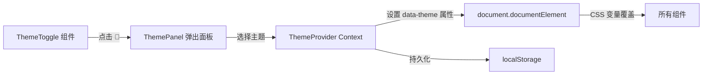

# 全站主题切换系统

## 架构设计




## 主题结构

支持两个维度：

- **模式（mode）**：`light` / `dark`
- **配色（color）**：`default`（暖棕） / `ocean`（海洋蓝） / `forest`（森林绿） / `lavender`（薰衣草紫） / `sunset`（日落橘）

通过 `data-theme-mode` 和 `data-theme-color` 两个 HTML 属性控制，CSS 变量用属性选择器覆盖。

## 文件变动

### 1. 新建 `src/components/ThemeToggle/` 组件

按项目规范创建三个文件：

- **ThemeToggle.tsx** - 主题切换按钮 + 弹出面板
  - 点击 🎨 弹出/收起面板（使用 motion 动画）
  - 面板分两部分：上方 light/dark 模式切换，下方配色圆点选择
  - 点击外部区域关闭面板
  - 支持系统偏好跟随（auto 选项）
- **ThemeToggle.css** - 面板样式
  - 面板从按钮上方向上弹出，毛玻璃风格与现有卡片一致
  - 配色选项为小色块圆点，hover 放大
- **index.ts** - 导出入口

### 2. 新建 `src/hooks/useTheme.ts` - 主题管理 Hook

核心逻辑：

```typescript
/** 主题模式 */
type ThemeMode = 'light' | 'dark' | 'system';
/** 主题配色 */
type ThemeColor = 'default' | 'ocean' | 'forest' | 'lavender' | 'sunset';

// - 读取 localStorage 缓存，无缓存时默认 system + default
// - 监听 prefers-color-scheme 媒体查询
// - 切换时同时更新 document.documentElement 的 data-theme-mode 和 data-theme-color
// - 写入 localStorage 持久化
```

### 3. 修改 [src/App.css](src/App.css) - 扩展 CSS 变量体系

现有 `:root` 下的变量保持不变作为 light + default 的基线。新增：

- `[data-theme-mode="dark"]` 选择器覆盖所有颜色相关变量
- `[data-theme-color="ocean"]` / `forest` / `lavender` / `sunset` 覆盖品牌色和强调色
- dark 模式下各配色的组合也需要覆盖（使用 `[data-theme-mode="dark"][data-theme-color="ocean"]` 等复合选择器）

暗色模式的主要变量映射：


| 变量                   | Light 值                 | Dark 值                   |
| -------------------- | ----------------------- | ------------------------ |
| `--color-primary`    | `#4E3F42`               | `#E8E0E0`                |
| `--color-secondary`  | `#7B888E`               | `#9CA3AF`                |
| `--color-bg`         | `#EEEEEE`               | `#1A1A2E`                |
| `--color-card`       | `rgba(255,255,255,0.4)` | `rgba(255,255,255,0.06)` |
| `--color-card-solid` | `#FFFFFF`               | `#242438`                |
| `--color-border`     | `#FFFFFF`               | `rgba(255,255,255,0.1)`  |
| 阴影系列                 | 暖色调                     | 深色调低对比度                  |


### 4. 修改 [src/App.tsx](src/App.tsx) - 替换装饰图标

将现有的静态 `decorative-icon` div 替换为 `<ThemeToggle />` 组件：

```tsx
<div className="decorative-items">
  <ThemeToggle />
</div>
```

### 5. 修改各组件 CSS - 替换硬编码颜色

将组件中使用 `rgba(78, 63, 66, ...)` 和 `rgba(222, 67, 49, ...)` 等硬编码颜色替换为基于 CSS 变量的派生值。新增以下 CSS 变量到 `:root`：

```css
/* 派生的透明度变量，方便各组件引用 */
--color-primary-alpha-005: rgba(78, 63, 66, 0.05);
--color-primary-alpha-008: rgba(78, 63, 66, 0.08);
--color-primary-alpha-010: rgba(78, 63, 66, 0.1);
--color-primary-alpha-020: rgba(78, 63, 66, 0.2);
--color-primary-alpha-030: rgba(78, 63, 66, 0.3);
--color-primary-alpha-040: rgba(78, 63, 66, 0.4);
--color-accent-alpha-008: rgba(222, 67, 49, 0.08);
--color-accent-alpha-020: rgba(222, 67, 49, 0.2);
--color-overlay: rgba(0, 0, 0, 0.95);
--color-text-on-dark: white;
```

这些变量在 dark 模式和不同配色下会被正确覆盖。需要修改的组件 CSS 文件：

- Calendar.css、MusicPlayer.css、UserCard.css、ImageCard.css、SocialLinks.css、Card.css、IframeModal.css、RecommendCard.css、Tooltip.css、Carousel.css、WorldMap.css

### 6. 过渡动画

在 `body` 上添加全局过渡：

```css
body {
  transition: background-color var(--duration-normal) var(--easing-default),
              color var(--duration-normal) var(--easing-default);
}
```

各卡片组件的 `background`、`color`、`border-color`、`box-shadow` 属性也添加过渡，实现平滑切换效果。

## ThemeToggle 面板交互设计

面板从 🎨 按钮**上方弹出**，内容结构：

```
+---------------------------+
|  ☀️  Light  |  🌙 Dark  |   <-- 模式切换（两段式按钮）
|  💻  跟随系统             |   <-- system 选项
+---------------------------+
|  配色                      |
|  🟤  🔵  🟢  🟣  🟠     |   <-- 5 个色块圆点
+---------------------------+
```

- 使用 motion 的 `AnimatePresence` 做弹出/收起动画（scale + opacity）
- 当前选中的模式和配色有高亮指示
- 点击面板外部自动关闭

